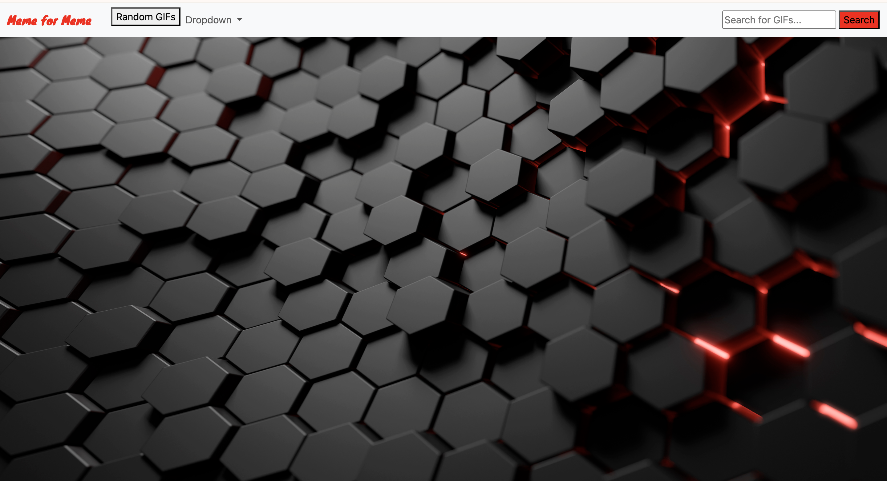
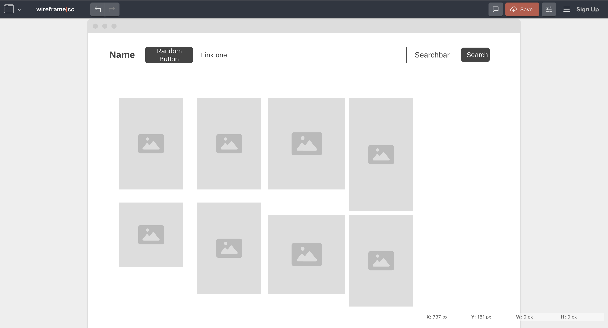

# Meme for Meme

## Description
The objective is to create a responsive website that where people search a specific title and recive 50 meme's and desplays them for the user to see, also there is a random button that gives the user random Gif's / Meme's
## Screen Shot

### Main page 

### When clicked random button

### When using the search bar

## Technology used
    * JavaScript
    * HTML
    * CSS
    * Google Fonts
    

## User Story
- Story 1
    As A User, I want to be able to search specific names and display images for the user to see.

- Story 2
    As A User, I want a be able to click a button and display an assortment of random Gif's/ Meme's

- Story 3
    As a user, I want to

## Wireframe

### Mainpage after search button clicked

## Next Steps
* I would also like to add a better front showing for users enjoyment like a moving background and displays of some Gif's/ Meme's
 * Next step would be to add somthing to the catagory tabs sections and make it so within the sections you can only search for items of that type within that page
 * I would to work on the responsivenes and display of the page when using it on a mobile device and webpage.
 * I would also make it 

## Author
Joshua Pierson: <a href="https://www.linkedin.com/in/joshua-pierson726" rel="nofollow">@Linkedin</a>